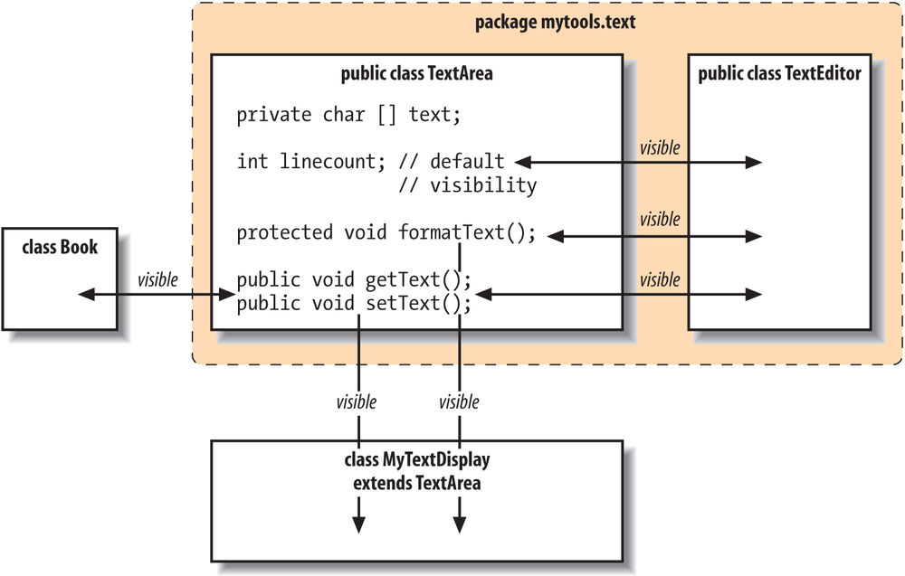
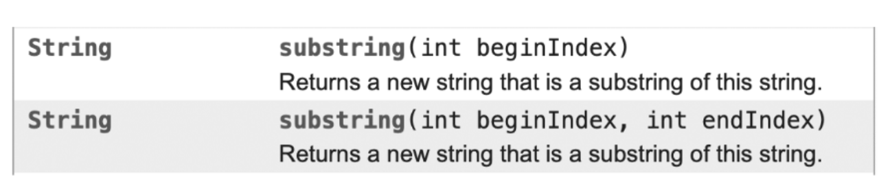

# CONTENIDOS: Introducción a la programación orientación a objetos

- ## Clases. Atributos, métodos y visibilidad.
- ## Objetos. Estado, comportamiento e identidad. Mensajes.
- ## Encapsulado. Visibilidad.
- ## Relaciones entre clases.
- ## Principios básicos de la orientación a objetos.

## Clases. Atributos, métodos y visibilidad.

Al hablar de programación orientada a objetos (POO), los conceptos de **Clase** y **Objeto** aparecen siempre en primer lugar. 

Las clases tratan de modelar elementos de la vida real, describiendo las propiedades (campos o atributos) y las habilidades (métodos) de éste. 

Por ejemplo, en una tienda on-line, los pedidos  tienen
atributos, como su referencia o la lista de productos, y métodos, como añadir un producto o eliminarlo del pedido.

Una clase es un modelo o plantilla para un objeto. Un objeto es una instancia de una clase, y contiene todas las propiedades y comportamientos definidos por la clase.

En Java, podemos definir una clase utilizando la palabra clave `class` seguida del nombre de la clase. Por ejemplo:

```java
class MiClase {
  // propiedades y métodos de la clase
}
```

Para crear un objeto de una clase, debemos utilizar el operador `new` seguido del nombre de la clase y paréntesis. Por ejemplo:

```java
MiClase miObjeto = new MiClase();
```

Y una vez que hemos creado el objeto (instanciado) , podemos acceder a sus atributos(propiedades) y métodos mediante el operador "punto" `.`. Por ejemplo:

```java
miObjeto.miPropiedad = "valor";
miObjeto.miMetodo();
```

Para que la creación de un objeto funcione como nosotros deseamos, previamente hemos de haber definido  el  constructor o constructores, que son métodos especiales de las clases que definen cómo se crean los objetos de esa clase.  Cada clase tiene al menos un constructor, y puede tener varios constructores con diferentes argumentos.

En Java, para definir un constructor, se hace de la siguiente manera:

```java
class MiClase {
  // atributos de la clase

  // constructor
  public MiClase() {
    // código de inicialización
  }
}
```

Además de definir un constructor vacío (sin argumentos, como el ejemplo anterior), también se pueden definir constructores con argumentos para permitir que el usuario especifique valores para los atributos del objeto al crearlo. Por ejemplo:

```java
class MiClase {
  // atributos de la clase
  String nombre;
  int edad;

  // constructor con argumentos
  public MiClase(String nombre, int edad) {
    this.nombre = nombre;
    this.edad = edad;
  }
}

// crear un objeto utilizando el constructor con argumentos
MiClase miObjeto = new MiClase("Juan", 30);
```

> #### NOMBRES EN JAVA: CamelCase
> 
> CamelCase es una convención de nomenclatura que se utiliza a menudo en la programación para nombrar variables, métodos y clases. En CamelCase, las palabras se combinan y se escriben sin espacios, con la primera letra de cada palabra excepto la primera en mayúsculas.
> 
> Por ejemplo, en lugar de escribir "numero de cuenta", se escribiría "numeroDeCuenta" utilizando CamelCase.
> 
>  Hay dos formas de usar Camel case:
> 
> - **lower camelCase**: donde el primer carácter de la primera palabra está en minúsculas. Esta convención generalmente se sigue al nombrar los **métodos** y las **variables**. 
>   Ejemplo: firstName, lastName, etc.
> - **upper CamelCase**: también conocido como "title case", donde el primer carácter de la primera palabra está en mayúscula. Esta convención generalmente se sigue al nombrar las **clases** e **interfaces**. 
>   Ejemplo: ClasePrincipal, InterfazVacio, etc.
> 
> Hay otras formas de nombrar las palabras reservadas conocida como **snake_case**, en la que las palabras se separan con guiones bajos.
> Ej: numero_de_cuenta

Con frecuencia hallamos muchas clases en nuestros programas, así que hay que organizarlas bien. Para ello recurriremos a los **paquetes**, que son colecciones de clases que encajan
lógicamente y que pueden interactuar entre ellas.

### Métodos

Los métodos son una parte importante de la programación orientada a objetos (POO) y se utilizan para describir el comportamiento de un objeto.

Los métodos son conjuntos de instrucciones cuya misión es la realización de una tarea espefícifca para resolver una necesidad de la clase u ofrecer una funcionalidad.

Como norma general, los identificadores que se usan para identificar los métodos suelen corresponderse con verbos que describen la acción que realizan. Los métodos suelen usar los datos contenidos en la clase, aunque es posible que no los necesiten.Al crear un método, éste está disponible para todos los objetos de la clase a la que pertenece. 

Para declarar un método,  en primer lugar debemos actuar como hacemos con un programa básico y su método `Main`: establecer la visibilidad, tipo de método, tipos de retorno, identificador y parámetros de entrada. 
A continación, el cuerpo del método va encerrado entre llaves conteniendo el código, así como la declaración de variables locales. 
La sintaxis genérica es:

```java
[visibilidad] [static] tipo nombre ([tipo paramUno] [tipo paramDos] ... [tipo paramN]) {
    //variables y código
    [return valor]
}
```

Siendo más específicos, un ejemplo de creación de un método podría ser el siguiente:

```java
class MiClase {
  // atributos de la clase

  // método
  public void miMetodo() {
    // código del método
  }
}
```

Para llamar a un método en un objeto, utilizamos el operador `.` y el nombre del método. Por ejemplo:

```java
MiClase miObjeto = new MiClase();
miObjeto.miMetodo();
```

Los métodos también pueden tener argumentos y valores de retorno. Por ejemplo:

```java
class MiClase {
  // atributos de la clase

  // método con argumentos y valor de retorno
  public int sumar(int a, int b) {
    return a + b;
  }
}

MiClase miObjeto = new MiClase();
int resultado = miObjeto.sumar(2, 3); // resultado = 5
```

### Atributos

Los atributos de una clase son variables que contienen información sobre el objeto.  Estos atributos en java se representan dentro del cuerpo de la clase mediante
campos (fields), también llamados variables miembro (Member variables).

La sintaxis  que podemos usar para declarar los campos de una clase es:

```java
[Visibilidad] [static] tipo campol;
```

Como vemos, tiene dos modificadores opcionales que estudiaremos más detenidamente en otros apartados.

En Java, podemos crear los atributos de una clase declarando variables de instancia dentro de la clase, pero fuera de cualquier método.

Es muy recomendable darle al atributo un valor predeterminado asignándole un valor cuando lo declaramos. Por ejemplo: `int cuenta = 0`;

En caso de no asignarle un valor predeterminado, Java le dará un valor predeterminado en función de su tipo de datos. Por ejemplo, a un atributo int se le asignará el valor 0 y a un atributo booleano se le asignará el valor `false`.

Para obtener el valor de un atributo, accedemos a él mediante el operador `.`, poniendo el nombre del objeto creado y el atributo del que queremos obtener su valor:

`int saldoActual = miCuenta.saldo;`

Como diferencia con los métodos, el atributo no lleva paréntesis.

Una segunda opción es crear un método `getter` para permitir que otras clases accedan al valor de un atributo. Un método `getter` es un método que devuelve el valor del atributo.

De la misma manera, podemos crear un método `setter` para permitir que otras clases modifiquen el valor de un atributo. Un método `setter` es un método que toma un nuevo valor como parámetro y lo asigna al atributo.

```java
  // Atributo de la clase
  private String nombre;

  // Getter
  public String getNombre() { 
      return nombre; 
    }

  //Setter
  public void setNombre(String N)
  {
    // con this nos referimos al atributo de esta clase
    this.nombre = N;
  }
```

Es una buena práctica hacer que los atributos sean privados y usar getters y setters para acceder a ellos y modificarlos, ya que esto le permite controlar cómo otras clases pueden interactuar con los atributos y hacer cumplir cualquier regla o restricción en los valores de los atributos.

### Visibilidad

La visibilidad de una clase, método o atributo en Java se refiere a cuánto es accesible desde otras partes del código. Hay cuatro niveles de visibilidad en Java:

1. `public`: Este nivel de visibilidad significa que el elemento es accesible desde cualquier parte del código.

2. `protected`: Este nivel de visibilidad significa que el elemento es accesible desde la clase en la que se define y todas las clases que heredan de ella.

3. `default` (también conocido como "package private"): Este nivel de visibilidad significa que el elemento es accesible solo desde la clase en la que se define y otras clases del mismo paquete.

4. `private`: Este nivel de visibilidad significa que el elemento es accesible solo desde la clase en la que se define.

Es importante tener en cuenta que, por defecto, los elementos en Java tienen visibilidad de paquete. Si no se especifica ningún modificador de acceso, se asume que el elemento es de paquete.

Ejemplo:

```java
public class MiClase {
  private int atributoPrivado;
  protected int atributoProtegido;
  int atributoPaquete; // default visibility
  public int atributoPublico;

  private void metodoPrivado() {
    // código
  }

  protected void metodoProtegido() {
    // código
  }

  void metodoPaquete() { // default visibility
    // código
  }

  public void metodoPublico() {
    // código
  }
}
```

En este ejemplo, `atributoPrivado` y `metodoPrivado` solo son accesibles desde `MiClase`, mientras que `atributoProtegido` y `metodoProtegido` son accesibles desde `MiClase` y cualquier clase que herede de `MiClase`. `atributoPaquete` y `metodoPaquete` son accesibles solo desde `MiClase` y otras clases del mismo paquete, mientras que `atributoPublico` y `metodoPublico` son accesibles desde cualquier parte del código.

La visibilidad de los métodos y las variables los veremos más adelante, a modo de recordatorio, podemos repasar los tres tipos de variables que Java proporciona:

- **Variables de clase**: las variables de clase, también conocidas como variables estáticas, se declaran con la palabra clave static en una clase, pero fuera de un método, constructor o bloque. Solo habría una copia de cada variable de clase por clase, independientemente de cuántos objetos se creen a partir de ella.

- **Variables de instancia**: las variables de instancia se declaran en una clase, pero fuera de un método. Cuando se asigna espacio para un objeto en el montón, se crea una ranura para cada valor de variable de instancia. Las variables de instancia contienen valores a los que debe hacer referencia más de un método, constructor o bloque, o partes esenciales del estado de un objeto que deben estar presentes en toda la clase.

- **Variables locales**: las variables locales se declaran en métodos, constructores o bloques. Las variables locales se crean cuando se ingresa el método, constructor o bloque y la variable se destruirá una vez que salga del método, constructor o bloque.

Podemos ver en esta tabla la comparativa de las varacterísticas más relevantes de cada uno de los tipos de variables:

Variables locales | Variables de instancia | Variables estáticas |
| -- | -- | -- |
Las variables declaradas dentro de un método son variables locales. | Una variable de instancia se declara dentro de una clase pero fuera de cualquier método o bloque. | Las variables estáticas se declaran dentro de una clase pero fuera de un método que comienza con una palabra clave estática.|
El alcance de la variable local se limita al método en el que se declara. | Se puede acceder a una variable de instancia en toda la clase. | La variable estática es accesible en toda la clase. |
Una variable local comienza su vida útil cuando se invoca el método. | El objeto asociado con la variable de instancia decide su duración. | La variable estática tiene el mismo tiempo de vida que el programa. |
La variable local es accesible a todos los objetos de la clase. | La variable de instancia tiene diferentes copias para diferentes objetos. | Las variables estáticas solo tienen una sola copia de toda la clase. |
Se utiliza para almacenar valores necesarios para un método en particular. | Se utiliza para almacenar valores a los que se necesita acceder mediante diferentes métodos de la clase. | Se utiliza para almacenar constantes. |

## Objetos. Estado, comportamiento e identidad. Mensajes.

Cualquier entidad que tiene estado y comportamiento se conoce como objeto. Por ejemplo, una silla, un coche, una mesa, un teclado, etc. Puede ser físico o lógico.

Un objeto se puede definir como una **instancia** de una clase. Un objeto contiene una dirección y ocupa algo de espacio en la memoria. Los objetos pueden comunicarse sin conocer los detalles de los datos o el código de los demás. Lo único necesario es el tipo de mensaje aceptado y el tipo de respuesta devuelta por los objetos.

Ejemplo: Un perro es un objeto porque tiene estados como color, nombre, raza, etc. así como comportamientos como mover la cola, ladrar, comer, etc.

Una entidad que tiene estado y comportamiento se conoce como objeto, por ejemplo, silla, bicicleta, marcador, bolígrafo, mesa, automóvil, etc. Puede ser físico o lógico (tangible e intangible). El ejemplo de un objeto intangible es el sistema bancario.

Un objeto tiene tres características:

- **Identidad**: la identidad de un objeto generalmente se implementa a través de una identificación única. El valor de la ID no es visible para el usuario externo. Sin embargo, la JVM lo utiliza internamente para identificar cada objeto de forma única.
- **Estado**: representa los datos (valor) de un objeto.
- **Comportamiento**: representa el comportamiento (funcionalidad) de un objeto como depósito, retirada, extracto, etc.

Por ejemplo, supongamos que Lapiz es un objeto. Entonces:

- su nombre es Pepe (podríamos considerarlo como su identidad, aunque sabemos que no es asi).
- su color es blanco, conocido como su estado. 
- se utiliza para escribir, por lo que la escritura es su comportamiento.

Un objeto es una instancia de una clase. Una clase es una plantilla o modelo a partir del cual se crean objetos. Entonces, un objeto es la instancia (resultado) de una clase.

**Definiciones de objetos:**

- Un objeto es una entidad del mundo real.
- Un objeto es una entidad de tiempo de ejecución.
- El objeto es una entidad que tiene estado y comportamiento.
- El objeto es una instancia de una clase.

## Encapsulado. Visibilidad.

Uno de los aspectos más importantes del diseño orientado a objetos es la ocultación de datos o **encapsulación** . Al tratar un objeto en algunos aspectos como una "caja negra" e ignorar los detalles de su implementación, podemos escribir código más resistente y simple con componentes que se pueden reutilizar fácilmente.

Podemos crear una clase completamente encapsulada en Java haciendo que todos los miembros de datos de la clase sean privados. Ahora podemos usar los métodos setter y getter para configurar y obtener los datos.

#### Ventajas de la encapsulación en Java

- Al proporcionar solo un método setter o getter, podemos hacer que la clase sea de solo lectura o solo escritura. En otras palabras, podemos omitir uno de los métodos getter o setter.

- Nos proporciona el control sobre los datos. Supongamos que necesitamos establecer el valor de id, que debe ser mayor que 100 únicamente, podemos escribir la lógica dentro del método setter. Además podemos escribir la lógica para no almacenar los números negativos en los métodos de establecimiento.

- Es una forma de lograr la ocultación de datos en Java porque otra clase no podrá acceder a los datos a través de los datos miembros (member variables) privados.

- La clase encapsulada es fácil de probar. Por lo tanto, es mejor para las pruebas unitarias.

- Los IDE estándar brindan la posibilidad de generar getters y setters, por lo que  es fácil y rápido crear una clase encapsulada en Java.

De forma predeterminada, las variables y los métodos de una clase son accesibles para los miembros de la propia clase y para otras clases del mismo paquete (package). 

Los modificadores `public` y `private`, por otro lado, definen los dos extremos en cuanto a visibilidad:

- los métodos y variables declarados como `private` solo son accesibles dentro de su clase. 
- En el otro extremo del espectro, se puede acceder a los miembros declarados como `public`  desde cualquier clase en cualquier paquete, siempre que se pueda ver la clase en sí. (La clase que contiene los métodos también debe ser pública para verse fuera de su paquete, como discutimos anteriormente). Los miembros públicos de una clase deben definir su funcionalidad más general.

En la siguiente imagen podemos ver la visibilidad de las variables y los métodos dependiendo de los modificadores usados en su creación:



El tercer modificador que podemos usar es  `protected`. Este permite permisos de acceso especiales para las subclases. Al contrario de lo que pueda parecer, `protected` es un poco menos restrictivo que el nivel predeterminado de accesibilidad. Además de las clases otorgadas de acceso predeterminado en el mismo paquete, los miembros protegidos son visibles para las subclases de la clase, incluso si están definidos en un paquete diferente.

modificador |  Visibilidad fuera de la clase. |
| -- | -- |
private | Ninguna |
Sin modificador (default) | clases en el paquete |
protected | Clases en paquete y subclases dentro o fuera del paquete. |
public | Todas las clases de todas las aplicaciones |

## Relaciones entre clases.

### Herencia

La herencia en Java es el proceso de crear una nueva clase a partir de una clase existente, conocida como clase padre o superclase. La clase hija, también conocida como clase derivada, hereda todas las propiedades y comportamientos de la clase padre y puede tener sus propias propiedades y comportamientos adicionales.

Para crear una clase hija en Java, se utiliza la palabra clave "extends" seguida del nombre de la clase padre. Por ejemplo:

```java
public class ClaseHija extends ClasePadre {
  // Propiedades y métodos de la clase hija
}
```

En Java, por defecto, todas las clases heredan de la superclase `Object`, que es la clase padre, clase base o superclase de todas. 

Cada nivel de clases extiende del nivel superior, de forma que es posible añadirle más propiedades o atributos y más métodos a la clase, además de heredar todas las propiedades y métodos de la superclase. Como añadido, podemos sobrescribir cualquier método de la clase padre utilizando la palabra clave "override". Por ejemplo:

```java
public class ClaseHija extends ClasePadre {
  @Override
  public void miMetodo() {
    // Implementación del método de la clase hija
  }
}
```

Si tomamos como ejemplo una clase Perro que extiende de la clase Animal que extiende a su vez de SerVivo, podemos decir del objeto `milu` que es un Perro, pero también que `milu`  es un Animal o un SerVivo. Y no solo lo diremos, sino que también trataremos a `milu`  como Perro, como Animal o como SerVivo, según nos convenga.

En Java solo se extiende de una clase. No existe la herencia múltiple. En otros lenguajes sí, pero en Java no. Sin embargo, en cuanto a la implementación de interfaces, Java sí admite que implementemos varias. Por ejemplo, podríamos tener una clase que fuera Clonable, Printable, SerializabIe, que son interfaces del API de Java , lo que básicamente significa que existe la opción de obligar a esa clase a implementar métodos de varias interfaces, esos métodos que la harían clonable, printable, serializable.

### Sobrecarga y sobrescritura

Veamos dos conceptos cuyo nombre quizás inducen a confusión, pero que no hacen lo mismo. Son la **sobrecarga** (overloading) y la **sobrescritura** (overwriting).

Hablamos de sobrecarga cuando hay varios métodos con el mismo nombre, pero con parámetros distintos. Por ejemplo, el método substring de la clase String: 


(Esta Imagen la podemos encontrar en la documentación oficial  del API de la clase String de Java)

Si nos fijamos, encontramos dos métodos llamados igual (substring), pero uno recibe como parámetro un entero, beginIndex, índice de inicio, mientras que el otro recibe dos enteros: beginIndex y endIndex, índices de comienzo y fin.

Estos métodos nos devuelven una subcadena de la cadena de texto que reciben. En el primer caso, nos devolverá la subcadena desde la posición recibida hasta el final, mientras que el segundo tomará la subcadena entre las dos posiciones definidas.

En efecto, es recomendable, al aplicar la sobrecarga, que todos los métodos con un mismo nombre realicen más o menos la misma función, como en este ejemplo. Si van a hacer cosas diversas, les pondremos nombres distintos; pero si hacen lo mismo con matices de diferencia, podemos utilizar la sobrecarga y aprovechar el mismo nombre.

Por otro lado, hallamos la **sobrescritura**, que es una técnica ligada a los mecanismos de herencia. Una subclase (o clase hija) puede implementar una versión propia de un método heredado de una de sus superclases. Se suele utilizar de la siguiente forma: la superclase hace una implementación del método por omisión, bastante general, y luego, a medida  que vamos bajando por la jerarquía las clases hijas, pueden ir implementando versiones más ajustadas a sus necesidades.

Es recomendable utilizar la anotación `@Override` para marcar los métodos que sobrescriben la implementación de su clase padre. De esta forma, el entorno de desarrollo nos avisará si hacemos algún cambio no permitido en ella, por ejemplo, la lista de parámetros, el tipo de retorno... que no es que podamos hacerlos, es que dejaría de ser una sobrescritura.

### [DESCARGAR EJEMPLO DE CLASE](../_resources/herencia.zip)

## Principios básicos de la orientación a objetos.

Ya hemos visto de forma básica la mayoría de conceptos en los que se basa la POO, pero si nos ceñimos al enfoque de Ingeniería del Software, hay cinco principios básicos, esto es, los conceptos fundamentales que se aplican a la POO en Java. Estos principios incluyen:

- **Abstracción**: La abstracción es el proceso de enfocarse en los aspectos esenciales de un problema o situación y ignorar los detalles secundarios. En POO, la abstracción se utiliza para representar conceptos importantes de manera simple y clara.

- **Encapsulación**: La encapsulación es el proceso de ocultar los detalles de implementación de una clase o un objeto, exponiendo solo sus elementos públicos. Esto permite que los objetos sean fácilmente reutilizables y modificables sin afectar su funcionamiento.

- **Herencia**: La herencia es el proceso de crear nuevas clases a partir de clases existentes. Las clases heredadas, también conocidas como clases hijas, pueden reutilizar el código y las propiedades de la clase padre, y también pueden tener sus propias propiedades y comportamientos.

- **Polimorfismo**: El polimorfismo es la capacidad de un objeto de tomar diferentes formas. En POO, el polimorfismo se refiere a la habilidad de una clase para tener diferentes implementaciones de un mismo método.

#### CRITERIOS DE CALIFICACIÓN:

| CUADERNO DE CLASE | PRUEBA ESCRITA | OBSERVACIÓN DIRECTA | BOLETIN EJERCICIOS |
|--|--|--|--|
|| | | | 
