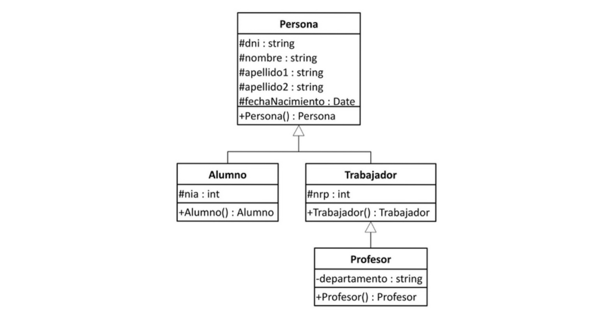

# Ejercicio 09

Crear en Java la siguiente jerarquía de clases:

Y añadir:

- Métodos 'get' y 'set' para cada uno de los campos.

- constructores parametrizados para cada una de las clases.

- Para los trabajadores, un atributo que guarde la fecha de incorporación al mercado laboral y un método que calcule la antigüedad.
